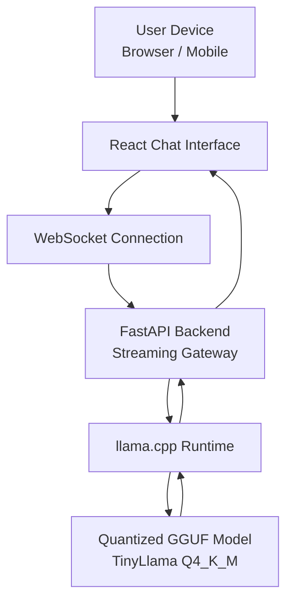
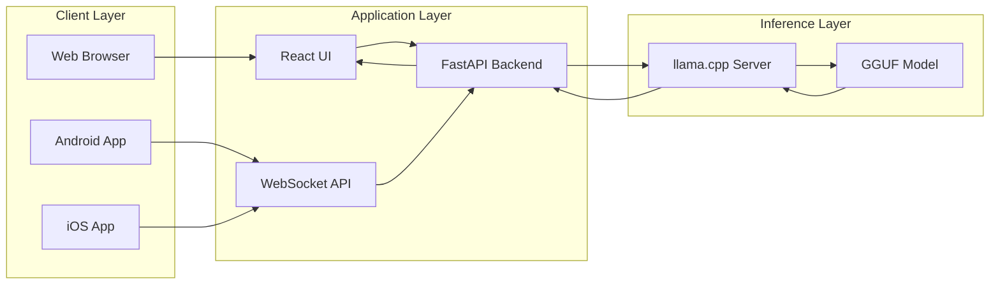
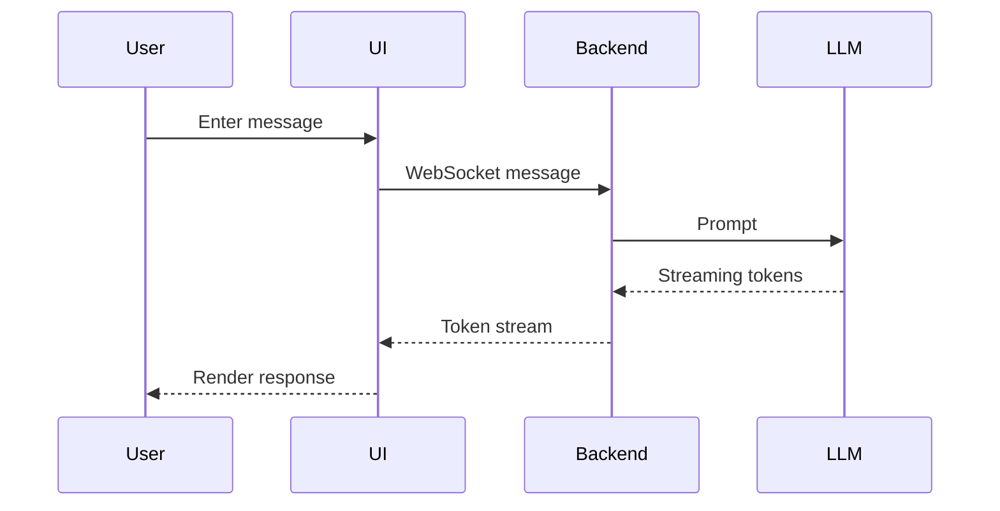

# Edge-LLM

### Local AI Chat System for Edge Devices


Edge-LLM is a **fully local Large Language Model system designed for edge hardware**.

It provides a **ChatGPT-style streaming chat interface** while running inference locally using quantized models.

The system demonstrates a **production-style architecture for local AI systems** including:

- Local LLM inference
- Streaming token responses
- WebSocket backend
- Chat UI
- Docker deployment
- Edge hardware compatibility

---

# Demo

Example interaction:

```
User:
Explain neural networks simply.

Assistant:
A neural network is a computer system inspired by the human brain.
It learns patterns from data using layers of connected nodes and can
recognize images, understand text, or make predictions.
```

Responses appear **token-by-token** for real-time chat.

---

# System Architecture



---

# System Design Diagram



---

# Data Flow



---

# Repository Structure

```
Edge-LLM/
├── README.md
├── dataset.txt
├── install.sh
├── pyproject.toml
├── requirements.txt
│
├── docker/
│   ├── Dockerfile
│   └── docker-compose.yml
│
├── mobile/
│   ├── android/
│   │   └── MainActivity.kt
│   └── ios/
│       └── ViewController.swift
│
├── src/
│   ├── benchmarks/
│   │   ├── benchmark_latency.py
│   │   ├── benchmark_memory.py
│   │   └── benchmark_tokens.py
│   │
│   ├── cli/
│   │   ├── __init__.py
│   │   └── cli.py
│   │
│   ├── convert/
│   │   ├── __init__.py
│   │   └── hf_loader.py
│   │
│   ├── generation/
│   │   ├── __init__.py
│   │   ├── sampler.py
│   │   └── speculative.py
│   │
│   ├── kernels/
│   │   ├── __init__.py
│   │   ├── flash_attention.py
│   │   └── int4_quant.py
│   │
│   ├── model/
│   │   ├── __init__.py
│   │   ├── model.py
│   │   └── transformer.py
│   │
│   ├── rag/
│   │   ├── __init__.py
│   │   ├── embedder.py
│   │   ├── ingest.py
│   │   ├── rag_pipeline.py
│   │   └── vector_store.py
│   │
│   ├── runtime/
│   │   ├── __init__.py
│   │   ├── config.py
│   │   ├── device.py
│   │   ├── kv_cache.py
│   │   ├── paged_allocator.py
│   │   ├── rope.py
│   │   └── tokenizer.py
│   │
│   ├── scheduler/
│   │   ├── __init__.py
│   │   ├── batching_engine.py
│   │   ├── request.py
│   │   └── scheduler.py
│   │
│   ├── server/
│   │   ├── __init__.py
│   │   ├── api_server.py
│   │   └── websocket_server.py
│   │
│   ├── tokenizer/
│   │   ├── merges.txt
│   │   └── vocab.json
│   │
│   ├── training/
│   │   ├── __init__.py
│   │   ├── dataset.py
│   │   ├── tokenizer_train.py
│   │   └── trainer.py
│   │
│   └── voice/
│       ├── __init__.py
│       ├── stt.py
│       ├── tts.py
│       └── voice_chat.py
│
├── ui/
│   └── chat-app/
│       ├── index.html
│       ├── package.json
│       ├── postcss.config.js
│       ├── tailwind.config.js
│       ├── vite.config.js
│       ├── eslint.config.js
│       ├── public/
│       │   └── vite.svg
│       └── src/
│           ├── App.jsx
│           ├── main.jsx
│           ├── index.css
│           ├── assets/
│           │   └── react.svg
│           └── components/
│               ├── ChatInput.jsx
│               ├── ChatLayout.jsx
│               ├── ChatMessage.jsx
│               ├── CodeBlock.jsx
│               ├── Sidebar.jsx
│               └── TypingIndicator.jsx
│
└── vosk-model-small-en-us-0.15/   # Speech recognition model (downloaded)
```

---

# Installation

Clone the repository:

```bash
git clone https://github.com/yourusername/Edge-LLM
cd Edge-LLM
```

Run installer:

```bash
chmod +x install.sh
./install.sh
```

---

# Run with Docker

Start the entire system:

```bash
docker compose up
```

Open the interface:

```
http://localhost:5173
```

---

# Manual Setup

### Start the model runtime

```bash
cd src/llama.cpp/build/bin

./llama-server \
-m ../../models/tinyllama-1.1b-chat-v1.0.Q4_K_M.gguf \
--port 8080
```

### Start backend

```bash
python -m cli.cli
```

### Start UI

```bash
cd ui/chat-app
npm install
npm run dev
```

Open:

```
http://localhost:5173
```

---

# Benchmark Results

Example benchmark using **TinyLlama Q4_K_M**.

| Hardware              | Tokens/sec | Latency |
| --------------------- | ---------- | ------- |
| Laptop CPU (Intel i7) | 22-30      | ~40 ms  |
| Mini PC Edge Server   | 25-35      | ~35 ms  |
| Jetson Orin           | 30-45      | ~25 ms  |
| Workstation CPU       | 35-50      | ~20 ms  |

Performance depends on:

- CPU architecture
- memory bandwidth
- model quantization

---

# Benchmark Script

Create file:

```
benchmarks/benchmark_llm.py
```

```python
import requests
import time

URL = "http://127.0.0.1:8080/completion"

payload = {
    "prompt": "Explain artificial intelligence simply.",
    "n_predict": 200
}

start = time.time()

response = requests.post(URL, json=payload)

end = time.time()

data = response.json()

tokens = data.get("tokens_predicted", 0)

elapsed = end - start

print("Tokens generated:", tokens)
print("Time:", elapsed)
print("Tokens per second:", tokens / elapsed if elapsed > 0 else 0)
```

Run benchmark:

```bash
python benchmarks/benchmark_llm.py
```

---

# Supported Platforms

Edge-LLM can run on:

- laptops
- mini PC edge servers
- Jetson boards
- workstation servers
- cloud VMs

Mobile devices act as **clients connecting to the edge server**.

---

# Mobile Clients

Android entry point:

```
android/MainActivity.kt
```

iOS entry point:

```
ios/ViewController.swift
```

Both connect to:

```
ws://<EDGE_DEVICE_IP>:8000/chat
```

---

# Technology Stack

Core technologies used:

- Python
- FastAPI
- WebSockets
- React
- llama.cpp
- Docker
- GGUF quantized models

---

# Why Edge-LLM

Most AI systems run entirely in the cloud.

Edge-LLM demonstrates that:

- LLMs can run locally
- AI chat interfaces can be built on edge hardware
- privacy-preserving AI systems are feasible

---

# Roadmap

Future improvements:

- Retrieval-Augmented Generation (RAG)
- multi-model switching
- vector database integration
- continuous batching
- hardware auto-optimization

---

# License

MIT License

---

# Author

Edge-LLM was built as a research and engineering project exploring **local LLM deployment and edge AI infrastructure**.
