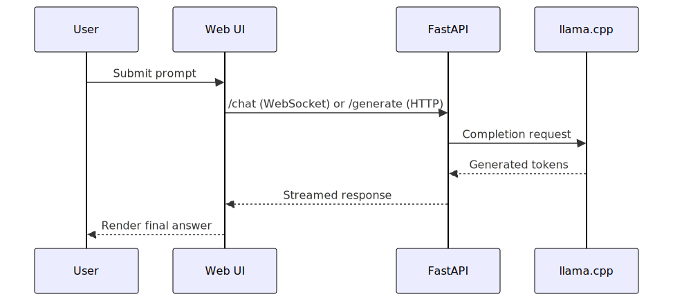

# Edge-LLM


## Problem

Running useful LLM features locally is usually fragmented:

- multiple always-on services
- cloud dependency for real-time UX
- separate mobile vs edge paths
- hard-to-reproduce setup and demos

## Solution

Edge-LLM provides one local-first stack for both edge devices and iOS:

- Docker runtime: `llama.cpp` + FastAPI + built React UI
- iOS runtime: SwiftUI + C bridge + `llama.cpp` XCFramework + GGUF
- one-command demo scripts for both paths
- profile-based capability scaling: `lite`, `standard`, `high-quality`

## Architecture

### End-to-End System



### Request Lifecycle (Edge Path)



## Demo Command

### Edge (full start flow)

```bash
./scripts/run_demo.sh
```

Options:

```bash
./scripts/run_demo.sh --profile standard
./scripts/run_demo.sh --profile high-quality --follow
./scripts/run_demo.sh --down --profile lite
```

### iOS Simulator (full run flow)

```bash
./scripts/run_ios_demo.sh
```

Target a specific simulator:

```bash
./scripts/run_ios_demo.sh --sim-name "iPhone 17 Pro"
./scripts/run_ios_demo.sh --sim-id 0DAAA551-21D2-4901-B9BC-C962A8338369
```

## Results

Current project state after full validation:

- Docker profile validation passes for `lite`, `standard`, and `high-quality`
- high-quality voice capability is fixed and passes smoke requirements
- iOS `llama-ios-skeleton` builds and tests pass
- simulator build path is operational through one-command runner

Core verification commands:

```bash
./scripts/validate_profiles.sh
python3 scripts/preflight.py
python3 scripts/smoke_test.py
```

## Why this matters

- Demonstrates strong local AI systems engineering, not just model prompting
- Shows end-to-end ownership: runtime, API, UI, iOS, reliability scripts
- Recruiter-friendly proof: reproducible one-command demos and clear architecture
- Practical deployment value for privacy-sensitive or low-connectivity environments

## Appendix

### Runtime tiers

- `lite`: minimal footprint for lower-resource CPUs
- `standard`: adds local RAG and heavier ML dependencies
- `high-quality`: adds voice I/O on top of `standard`

Profiles:

- `profiles/lite.env`
- `profiles/standard.env`
- `profiles/high-quality.env`

Default sample model:

- `models/tinyllama-1.1b-chat-v1.0.Q4_K_M.gguf`

### iOS setup details (manual path)

```bash
cd ios/llama-ios-skeleton
bash scripts/fetch_build_llama.sh
bash scripts/create_xcframework.sh
bash scripts/copy_xcframework_to_package.sh
bash scripts/sync_package_dependency.sh
bash scripts/open_in_xcode.sh
```

In Xcode:

1. Select scheme `LLamaDemo`
2. Select simulator or device
3. Build/Run (`Cmd+B`, `Cmd+R`)
4. Pick and load a valid generative `.gguf`

### Services and endpoints

- `llama` service on `:8080`
- `app` service on `:8000`

Endpoints:

- `/`
- `/api/info`
- `/health`
- `/generate`
- `/chat`

### Troubleshooting

If smoke fails on first attempt, retry after warm-up (already built into scripts).

If iOS build fails on symbols/headers, rebuild XCFramework:

```bash
cd ios/llama-ios-skeleton
bash scripts/create_xcframework.sh
bash scripts/copy_xcframework_to_package.sh
```

Use generative chat/instruct GGUF models, not vocab-only files.

## License

MIT
