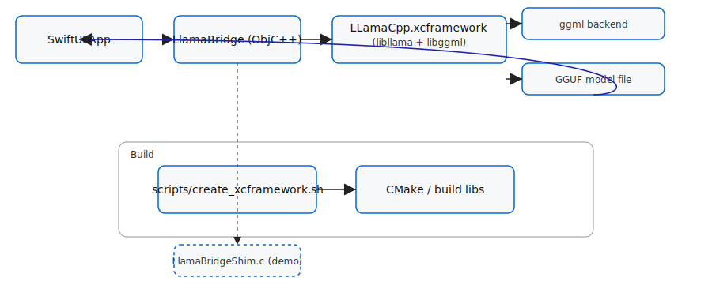

<!--
Enhanced README for the iOS LLama skeleton.
This file provides a badge-rich quickstart, architecture flow, and troubleshooting.
-->

# LLama iOS Skeleton — Edge‑LLM


Tiny, focused iOS sample that demonstrates wiring a SwiftUI app through an
Objective‑C++ bridge into a compiled `llama.cpp` runtime packaged as an
`XCFramework`. The project includes helper scripts to fetch/build `llama.cpp`,
create an `XCFramework` for device + simulator, and a Swift package manifest to
consume the binary bundle.

---

## Highlights

- Lightweight SwiftUI demo app (`LLamaDemo`) showing a bridge version string
- Objective‑C++ bridge (stub) and a `LlamaBridgeShim` C demo shim for testing
- Scripts to fetch/build `llama.cpp` and create an XCFramework
- macOS host harness (`tools/host_simple`) for native testing
- Tests: a small XCTest asserting the bridge returns a non-empty version

---

## Quickstart (local macOS)

Prerequisites:

- Xcode 15 (or later)
- Swift 5.9
- CMake, Ninja (recommended)
- Python (for optional helpers)

Commands — run from the iOS package root:

```bash
cd ios/llama-ios-skeleton
# fetch & build llama.cpp native libs
bash scripts/fetch_build_llama.sh

# build XCFramework (device + simulator)
bash scripts/create_xcframework.sh

# copy generated XCFramework into the binary Swift package
bash scripts/copy_xcframework_to_package.sh

# toggle Package.swift to prefer the binary package
bash scripts/sync_package_dependency.sh

# open in Xcode
bash scripts/open_in_xcode.sh
```

Open the `LLamaDemo` scheme in Xcode, select a simulator or device, then
`Cmd-B` (build) and `Cmd-R` (run).

---

## Architecture Flow

```mermaid
flowchart LR
	UI[SwiftUI App]
	UI -->|calls| Bridge[LlamaBridge (ObjC++)]
	Bridge -->|links| XC[LLamaCpp.xcframework]
	XC --> GGML[ggml backend]
	XC --> Model[GGUF model file]
	Model -->|tokens| UI

	subgraph Build
		Scripts[scripts/create_xcframework.sh]
		Scripts --> CMake[CMake: build libllama.a + libggml.a]
	end

	Bridge -.shim.-> Shim[LlamaBridgeShim.c (demo shim)]
```



This shows the runtime call path and how the build flow produces the
`XCFramework` that the Swift package consumes.

---

## Files of interest

- `Framework/LLamaCpp/Source/LlamaBridge.mm` — Objective‑C++ bridge (stub/integration)
- `Sources/LlamaBridgeShim/llama_bridge_shim.c` — small C shim used for the demo
- `scripts/create_xcframework.sh` — build & package script for XCFramework
- `tools/host_simple/` — macOS host test harness and CMake helper

---

## Troubleshooting

Common problem: linker errors like "Undefined symbols for architecture ... _ggml_*"

1) Confirm the `XCFramework` contains `libggml` symbols:

```bash
# adjust path if you placed the framework elsewhere
for a in LLamaCpp.xcframework/*/*/*.a; do
	echo "--- $a ---"
	nm -gU "$a" | grep ggml || true
done
```

If `ggml` symbols are missing, the combined static archive wasn't packaged.
When building slices, combine `libllama.a` and `libggml.a` into a single
static archive and recreate the `XCFramework`:

```bash
libtool -static -o combined.a path/to/libllama.a path/to/libggml.a
# then use xcodebuild -create-xcframework with the combined.a per-slice
```

2) Simulator vs device slices: ensure `arm64-simulator` / `x86_64` slices are
present for your target. Missing architectures cause link failures on the
simulator.

3) SwiftPM fallbacks: after copying a new `XCFramework`, run
`bash scripts/sync_package_dependency.sh` and clear Xcode DerivedData to ensure
the binary package is preferred.

4) Debugging logs: use a verbose `xcodebuild` to capture the full link command:

```bash
xcodebuild -scheme LLamaDemo -destination "platform=iOS Simulator,name=iPhone 14" clean build |& tee /tmp/llama_build.log
tail -n 200 /tmp/llama_build.log
```

---

## How to replace the stub bridge with real llama.cpp calls

There is an example integration file: `Framework/LLamaCpp/Source/LlamaBridge_integration_example.mm`.
Follow that outline to:

1. Link the XCFramework target that provides `libllama.a`/`libggml.a` into
	 the package target containing `LlamaBridge.mm`.
2. Implement model loading (GGUF) and `llama_eval` / token streaming.
3. Expose simple C APIs for Swift via the Objective‑C++ bridge.

---

## Contributing

PRs welcome. If you add a new build flow or CI, please update the badges and
the `scripts/` docs so the Quickstart stays accurate.

---

## License & Acknowledgements

This sample follows the main repo license (MIT). It builds on `llama.cpp` and
`ggml` for model runtime — respect upstream licenses when distributing built
artifacts.

Thank you to the open-source projects that make on-device ML possible.
